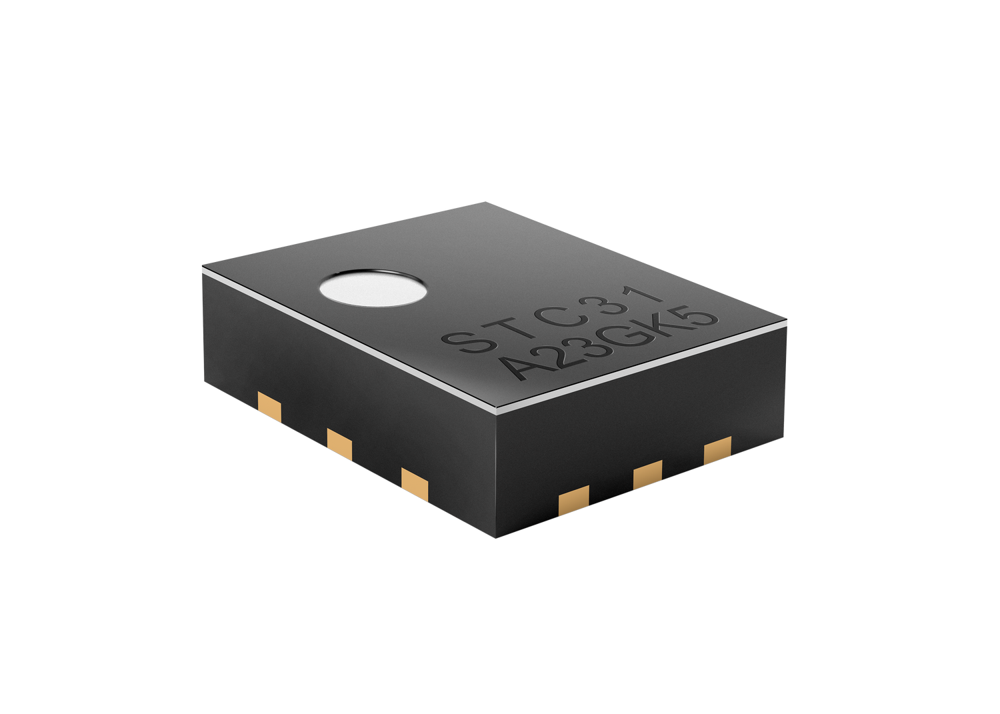

# Sensirion Raspberry Pi I2C STC3x Driver

This document explains how to set up the STC3x sensor to run on a Raspberry Pi
using the provided code.

[<center></center>](https://www.sensirion.com/en/environmental-sensors/carbon-dioxide-sensors/co2-sensor-stc31-coming-soon/)

Click [here](https://www.sensirion.com/en/environmental-sensors/carbon-dioxide-sensors/co2-sensor-stc31-coming-soon/) to learn more about the STC3x Sensor.


Setup Guide
-----------

### Connecting the Sensor

We'll be using the following pins of your sensor: VCC, GND, SDA and SCL.

Refer to the [datasheet](https://www.sensirion.com/fileadmin/user_upload/customers/sensirion/Dokumente/12_Thermal_Conductivity/Datasheets/Sensirion_Thermal_Conductivity_Datasheet_STC31_D1.pdf)

If you're using the STC3x Evaluaton Kit with the sensor soldered to a Flex PCB, the pinout is as follows:

<center></center>

Use the following schema to connect your STC3x:

 *STC3x*  |    *Raspberry Pi*
 :------: | :------------------:
   VCC    |        Pin 1
   GND    |        Pin 6
   SDA    |        Pin 3
   SCL    |        Pin 5

<center></center>


### Raspberry Pi

- [Install the Raspberry Pi OS on to your Raspberry Pi](https://projects.raspberrypi.org/en/projects/raspberry-pi-setting-up)
- [Enable the I2C interface in the raspi-config](https://www.raspberrypi.org/documentation/configuration/raspi-config.md)
- Download the driver for the [Sensirion Github Page](https://github.com/Sensirion/raspberry-pi-i2c-stc3x) and extract the `.zip` on your Raspberry Pi
- Compile the driver
    1. Open a [terminal](https://www.raspberrypi.org/documentation/usage/terminal/?)
    2. Navigate to the driver directory. E.g. `cd ~/raspberry-pi-i2c-stc3x`
    3. Run the `make` command to compile the driver

       Output:
       ```
       rm -f stc3x_i2c_example_usage
       cc -Os -Wall -fstrict-aliasing -Wstrict-aliasing=1 -Wsign-conversion -fPIC -I. -o stc3x_i2c_example_usage  stc3x_i2c.h stc3x_i2c.c sensirion_i2c_hal.h sensirion_i2c.h sensirion_i2c.c \
       	sensirion_i2c_hal.c sensirion_config.h sensirion_common.h sensirion_common.c stc3x_i2c_example_usage.c
       ```
- Test your connected sensor
    - Run `./stc3x_i2c_example_usage` in the same directory you used to
      compile the driver.

      Output:
      ```
      Product Number: 0x08010301
      Serial Number: 3617857464944295936
      Self Test: 0x0000 (OK = 0x0000)
      Set binary gas to 0x0001
      Gas: -0.921631 - Temperature: 24.610001
      Gas: -0.955200 - Temperature: 24.615000
      Gas: -0.927734 - Temperature: 24.635000
      ...
      ```

Troubleshooting
---------------

### Initialization failed

-   Ensure that you connected the sensor correctly: All cables are fully
    plugged in and connected to the correct pin.
-   Ensure that I2C is enabled on the Raspberry Pi. For this redo the steps on
    "Enable the I2C interface in the raspi-config" in the guide above.
-   Ensure that your user account has read and write access to the I2C device.
    If it only works with user root (`sudo ./stc3x_i2c_example_usage`), it's
    typically due to wrong permission settings.
